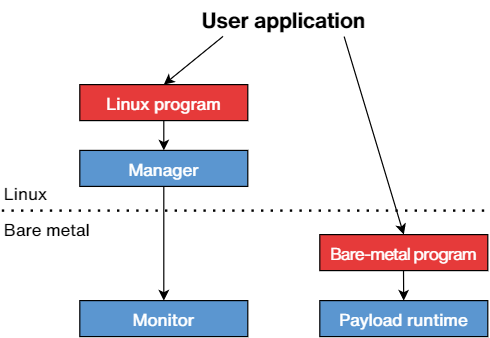

***************
How to build it
***************

The build system is driven by CMake. It is complicated by the need of using two separate toolchains in the process:

- ``aarch64-none-linux-gnu-gcc`` 12.3 (Linux)
- ``aarch64-none-elf-gcc`` 12.3 (bare metal)

The build system operates in one of 3 modes:

- :term:`manager`
- :term:`monitor`
- :term:`payload`

When building the manager, CMake will recurse into itself to build the monitor, which ends up being embedded in
the manager library. Due to this, a number of variables are mandatory, whether building the project stand-alone or via
``add_subdirectory``.

- BMBOOT_BSP_EL3_INCLUDE_DIR
- BMBOOT_BSP_EL3_LIBRARIES

To build the payload runtime support library, bmboot must be configured with the ``BMBOOT_BUILD_PAYLOAD`` CMake variable set.
Additionally, these are mandatory:

- BMBOOT_BSP_EL1_HOME
- BMBOOT_BSP_EL1_INCLUDE_DIR
- BMBOOT_BSP_EL1_LIBRARIES

Building Bmboot stand-alone
===========================

Example (might need to adjust the paths):

.. code-block:: shell

  export PATH=/opt/fgcd2/bin/arm-gnu-toolchain-12.3.rel1-x86_64-aarch64-none-linux-gnu/bin:\
              /opt/fgcd2/bin/arm-gnu-toolchain-12.3.rel1-x86_64-aarch64-none-elf/bin:\
              $PATH

  cmake -B build-bmboot \
      -DCMAKE_C_COMPILER=aarch64-none-linux-gnu-gcc \
      -DCMAKE_CXX_COMPILER=aarch64-none-linux-gnu-g++ \
      -DLIBRARIES_HOME=/opt/fgcd2/libs/

  cmake --build build-bmboot

This will build bmctl, the manager library, the monitor and a number of example programs.

User payloads
=============

The following CMake function should be used to declare payloads:

.. code-block:: cmake

  add_bmboot_payload(<name> [source1] [source2 ...])

The ``<name>`` argument will be used as a basis for naming the instantiated targets, which can be several,
in order to support multiple executor CPUs. All remaining arguments will be passed on to the underlying call(s) to
`add_executable`_.

.. _add_executable: https://cmake.org/cmake/help/latest/command/add_executable.html

The complete list of targets created will be saved into a variable called ``<name>_TARGETS``.

Voici un exemple:

.. code-block:: cmake

    cmake_minimum_required(VERSION 3.17)

    project(hello_world C CXX ASM)

    set(BMBOOT_BUILD_PAYLOAD 1)
    add_subdirectory(../bmboot ${CMAKE_CURRENT_BINARY_DIR}/bmboot)

    include(../bmboot/cmake/Bmboot.cmake)

    add_bmboot_payload(hello_world src/main.cpp)

    target_compile_definitions(hello_world PRIVATE HELLO=world)
    target_include_directories(hello_world PRIVATE include)

.. TODO: BSP concerns
