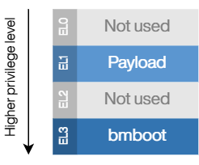
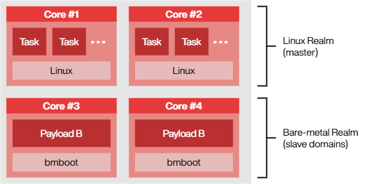

************
Introduction
************

Motivation -- why this project exists
=====================================

The FGC4 project current regulation and voltage source control require hard real-time and deterministic processing.
This, for a number of reasons, leads us to running bare metal code on selected cores of the FGC4’s CPU.
Due to our performance requirements, only the Cortex-A53 cores are feasible.

This raises a question; how to load the required code? It is true that the same bootloader that loads the main Operating
System could also start the additional cores. However, as the FGC4 is a very software-defined platform, fixing the code
at boot time might unduly limit the flexibility otherwise available.
Even accepting this limitation, we must face the reality that any code is bound to have bugs. On the Linux side,
there are established mechanisms for crash handling, including reporting and recovery from a problem.
On bare metal, one does not have this luxury, other that by using special debugging interfaces.

It is thus clear that some kind of management layer, or *monitor*, would both add value and reduce risk in the system.

*bmboot* was created to fulfill this need.

Design
======

bmboot executes on :term:`Exception Level 3 <EL3>`, the highest-privilege mode of the CPU.
The user program, called *payload*, is executed in :term:`EL1`.
Unlike in a traditional operating system, a running payload has exclusive ownership of CPU time.
In other words, the :term:`monitor` does not execute any of its code (and thus does not add any overhead or
unpredictability), except when explicitly instructed to intervene.

By design, bmboot is not a fully-fledged hypervisor. It only implements the minimum set of features necessary to meet
the needs of FGC4.

Although the monitor executes on a high privilege level, it is not in control of its own destiny.
At least one of the remaining CPU cores is assumed to run Linux, and have full authority over all the bare-metal cores.
The Linux realm initializes bmboot, determines the payload to be loaded, and can also interrupt its execution
at any time.

Communication
-------------

Communication between the two realms occurs primarily via shared memory.
On the Linux side, the ``/dev/mem`` special device is used. This avoids the need to develop a custom kernel driver.
A special case is when execution of the payload needs to be interrupted; in that case,
an :term:`Inter-Processor Interrupt <IPI>` is used to return control to the monitor.

Each exectutor domain has a range of memory dedicated for control & status. In the code, this is referred to as the
:term:`Inter-Process Communication (IPC) block <IPC block>`.

Cache coherency of the share memory region is not a problem, because the Cortex-A53 CPU includes a Snoop Control Unit
(SCU), which synchronizes L1 caches across the cores.

Project structure
=================

The project consists of several components.

Manager side
------------

- ``bmboot_manager`` library.
  This encompasses all the code necessary on the Linux side to initialize and control the executor domains.
  The library can be linked into user applications.
- command-line tools (``bmctl``, ``console``)

Executor side
-------------

- bmboot monitor implementation.
- ``bmboot_payload`` library.
  This is linked into user payloads in order to let them make use of the features of the monitor.

Glossary
========

.. glossary::

   board support package
   BSP
      A package of software libraries, initialization code, linker scripts etc. provided typically by a hardware vendor
      to facilitate software development for their platform.

      In case of Zynq UltraScale+, the BSP is generated by Vitis based on the FPGA design and additional options
      selected by the user.

      In the past, Bmboot required the BSP during compilation. This is not the case anymore.

   core dump
   core file
      Recorded state of the working memory of a computer program at a specific time, generally when the program has
      crashed or otherwise terminated abnormally.

      See also: :doc:`core-dump`

   domain
      A CPU core which can potentially become an :term:`executor`, if not in use by the operating system.

   executor
   executor domain
      A bare-metal core under the control of bmboot.

   exception level
   EL0
   EL1
   EL2
   EL3
      A concept in ARM CPUs which establishes a hierarchy of privilege between different code running on the CPU.
      A higher EL number indicates a higher level of privilege.

   IPC block
      A block of memory dedicated to communication between the :term:`manager` and an :term:`executor`.
      A separate IPC block is allocated to each executor.

   IPI
   Inter-Processor Interrupt
      A mechanism by which one CPU core can trigger an interrupt on another CPU core.

   IRQ
      Interrupt request

   manager
      A process running under Linux, which manages :term:`executor domains <executor domain>`.

   monitor
      The part of bmboot which runs on executor CPU cores.

   payload
      The user program which runs on executor CPU cores. It is started by the :term:`monitor` on user request.

   SMC
      Secure Monitor Call -- a way for the payload to invoke services provided by the monitor
